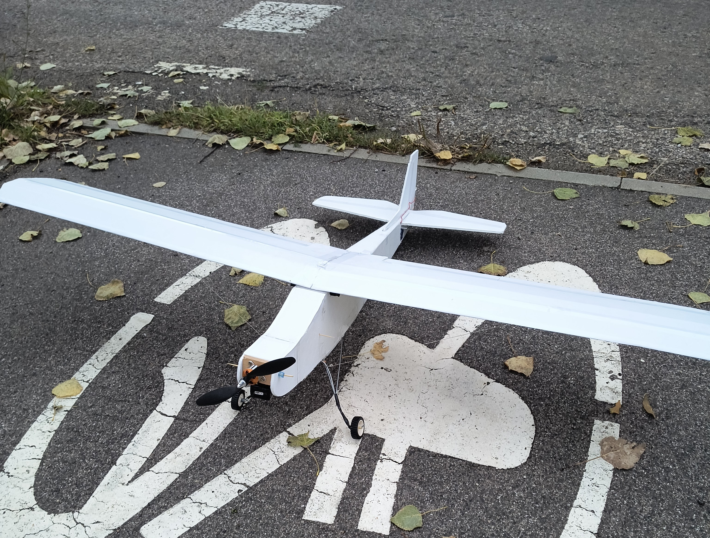
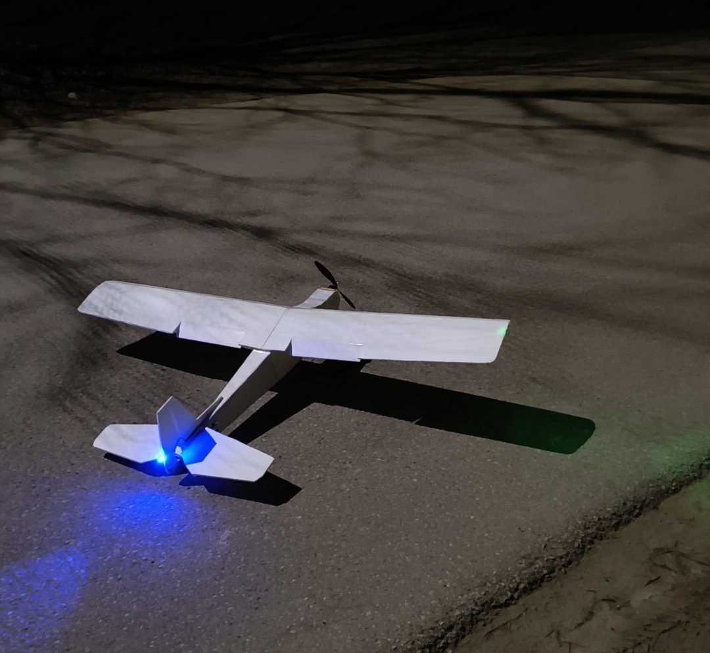
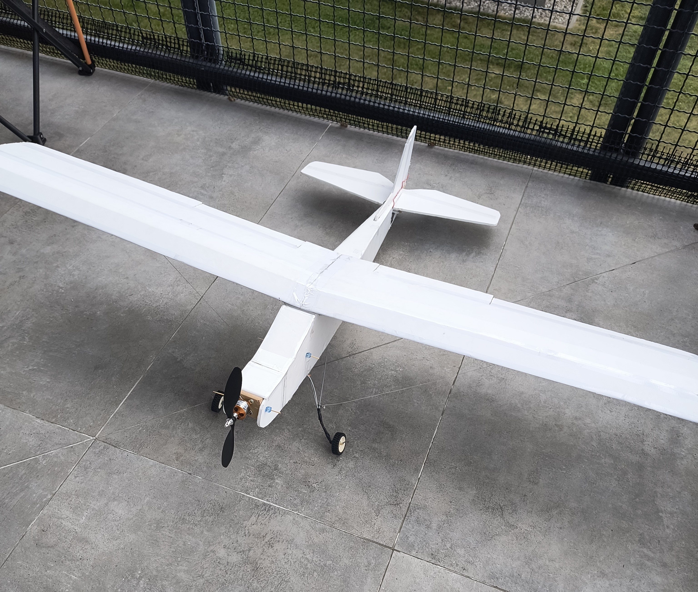
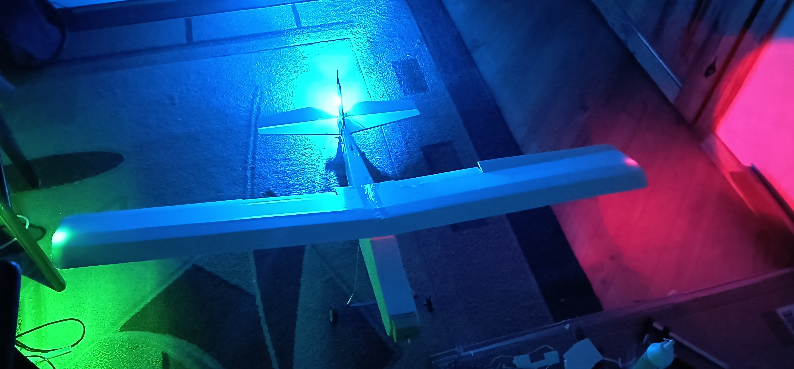
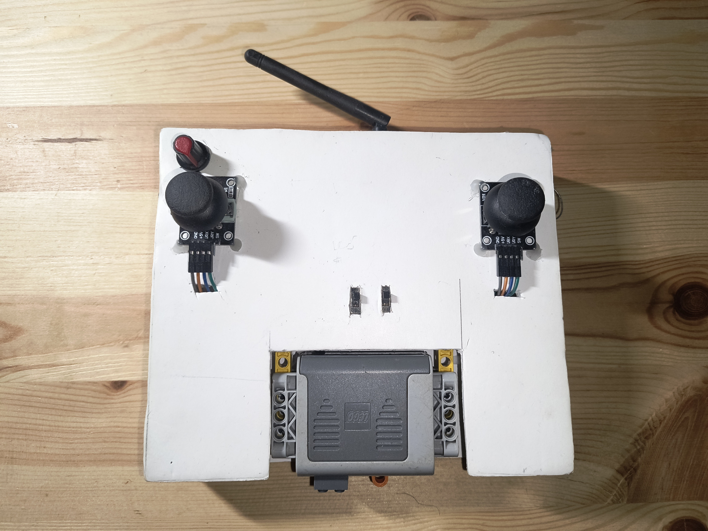

# Remote Controlled Plane Project ✈️



## Overview

This repository documents a hobby project by two computer science students aiming to build a **remote-controlled plane**, with long-term aspirations to evolve the system into an **autonomous aircraft**.

Currently, the physical structure of the plane is **fully assembled**, and we’ve developed a **basic transmitter and receiver system** using Arduino microcontrollers. While the plane is not airborne yet, foundational work in electronics and control systems is complete and being iterated on.

## Features

- Plane body fully built  
- Arduino-based transmitter and receiver prototypes  
- Flight capabilities in development  
- Plans to add GPS, sensors, and autonomous flight logic

## Repository Structure

```
.
├── transmitter.ino   # Arduino code for remote control transmitter
├── receiver.ino      # Arduino code for plane's onboard receiver
└── README.md         # Project overview and documentation
```

## How It Works

- **Transmitter**: Sends control signals over RF to the plane.
- **Receiver**: Interprets signals and drives control surfaces and motor.
- Communication is currently one-way, with manual control via two joysticks, switches and a throttle.


## Future Plans

- Add stabilization via IMU (gyroscope + accelerometer)
- Implement GPS navigation for waypoint following
- Develop a basic autonomous flight loop
- Introduce telemetry feedback and failsafe systems

## Authors

- Denis Lisovytskiy 
- Mateusz Błażejowski

## Gallery 




